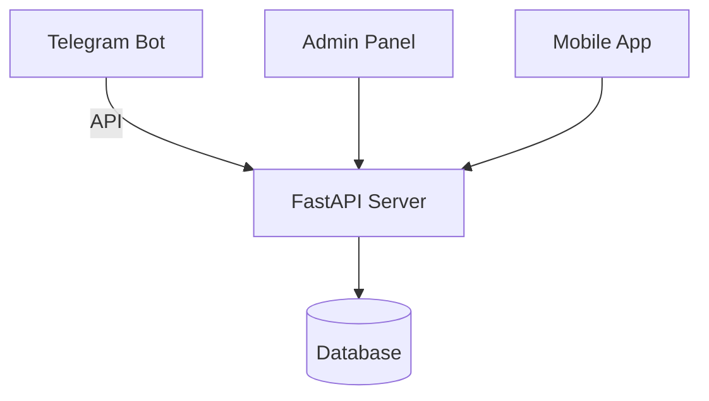

# 🩸 DonorBot - Система управления донорскими акциями

 *Логотип проекта*

## 🏆 Хакатон "Технологии добра"

**DonorBot** - это инновационная система для организации и управления донорскими акциями в учебных заведениях, разработанная командой *"Кровные братья"* на хакатоне "Технологии добра".

## 📌 Оглавление

1. [💡 Идея проекта](#-идея-проекта)
2. [✨ Особенности](#-особенности)
3. [🏗️ Архитектура](#️-архитектура)
4. [🛠️ Технологический стек](#️-технологический-стек)
5. [🚀 Запуск проекта](#-запуск-проекта)
6. [📱 Использование бота](#-использование-бота)
7. [🖥️ Административная панель](#️-административная-панель)
8. [📊 API Endpoints](#-api-endpoints)
9. [🧩 Структура проекта](#-структура-проекта)
10. [🤝 Вклад в проект](#-вклад-в-проект)
11. [📄 Лицензия](#-лицензия)
12. [👨‍💻 Команда](#-команда)

---

## 💡 Идея проекта

**Проблема:** Низкая вовлеченность студентов и сотрудников в донорское движение из-за сложностей с регистрацией, отсутствия информации и неудобного взаимодействия с организаторами.

**Решение:** Комплексная система, объединяющая:
- 🤖 Telegram-бота для доноров
- 🖥️ Веб-панель для организаторов
- 📊 Систему аналитики и отчетности

**Цель:** Упростить процесс участия в донорских акциях и увеличить количество регулярных доноров в 2 раза за год.

---

## ✨ Особенности

### Для доноров:
- 📅 Регистрация на мероприятия в 1 клик
- 📱 Удобный интерфейс в Telegram
- ℹ️ Вся информация о донорстве в одном месте
- 📍 Поиск ближайшего центра сдачи крови
- ❓ Возможность задать вопрос организаторам

### Для организаторов:
- 📊 Полная статистика по донорам и мероприятиям
- 📢 Гибкая система рассылок
- 📝 Управление мероприятиями
- 📥 Импорт/экспорт данных
- 👥 Управление командой организаторов

---

## 🏗️ Архитектура



1. **Telegram Bot** - основной интерфейс для доноров
2. **FastAPI Server** - backend система
3. **SQLite Database** - хранение данных
4. **Admin Panel** - веб-интерфейс для организаторов

---

## 🛠️ Технологический стек

### Backend:
- Python 3.10
- FastAPI
- SQLAlchemy
- Alembic (миграции)
- Telebot (python-telegram-bot)

### Frontend:
- HTML5, CSS3, JavaScript
- Jinja2 templates
- Chart.js (графики)

### База данных:
- SQLite (для разработки)
- PostgreSQL (для продакшена)

### Инфраструктура:
- Docker
- Nginx
- GitHub Actions (CI/CD)

---

## 🚀 Запуск проекта

### Предварительные требования:
- Python 3.10+
- Telegram bot token
- Доступ к серверу (для продакшена)

### Установка:

1. Клонируйте репозиторий:
```bash
git clone https://github.com/yourusername/donorbot.git
cd donorbot
```

2. Установите зависимости:
```bash
python -m venv venv
source venv/bin/activate  # Linux/MacOS
venv\Scripts\activate  # Windows
pip install -r requirements.txt
```

3. Настройте окружение:
Создайте файл `.env` в корне проекта:
```ini
BOT_TOKEN=your_telegram_bot_token
DATABASE_URL=sqlite:///donor.db
ADMIN_IDS=123456789,987654321
```

4. Инициализируйте базу данных:
```bash
python init_db.py
```

### Запуск:

1. Запустите FastAPI сервер:
```bash
uvicorn MainWebAPP:app --reload
```

2. Запустите Telegram бота:
```bash
python users_bot.py
```

3. Запустите бота для администраторов (в отдельном терминале):
```bash
python adminbot.py
```

---

## 📱 Использование бота

### Основные команды:
- `/start` - начать работу с ботом
- `📅 Ближайшие Дни Донора` - список мероприятий
- `🩸 Информация о донорстве` - требования и рекомендации
- `📝 Мои данные` - просмотр и редактирование профиля

### Процесс регистрации:
1. Отправьте контакт (номер телефона)
2. Введите ФИО
3. Выберите статус (студент/сотрудник)
4. Дайте согласие на обработку данных

---

## 🖥️ Административная панель

Доступна по адресу: `http://localhost:8000`

### Возможности:
- 👥 Управление донорами
- 📅 Создание мероприятий
- 📊 Просмотр статистики
- 📢 Отправка рассылок
- ❓ Ответы на вопросы

---

## 📊 API Endpoints

Основные эндпоинты:

| Метод | Путь | Описание |
|-------|------|----------|
| GET | `/api/donors` | Список доноров |
| POST | `/api/events` | Создание мероприятия |
| GET | `/api/stats` | Получение статистики |

Пример запроса:
```bash
curl -X GET "http://localhost:8000/api/donors" -H "accept: application/json"
```

---

## 🧩 Структура проекта

```
donorbot/
├── bots/                   # Telegram боты
│   ├── users_bot.py        # Бот для доноров
│   └── adminbot.py         # Бот для администраторов
├── webapp/                 # Веб-приложение
│   ├── MainWebAPP.py       # FastAPI приложение
│   └── templates/          # HTML шаблоны
├── database/               # Работа с базой данных
│   ├── models.py           # Модели SQLAlchemy
│   └── migrations/         # Миграции базы данных
├── static/                 # Статические файлы
├── tests/                  # Тесты
├── requirements.txt        # Зависимости
└── README.md               # Этот файл
```

---

## 🤝 Вклад в проект

Мы приветствуем вклад в проект! Вот как вы можете помочь:

1. Форкните репозиторий
2. Создайте ветку для вашей фичи (`git checkout -b feature/amazing-feature`)
3. Сделайте коммит ваших изменений (`git commit -m 'Add some amazing feature'`)
4. Запушьте в ветку (`git push origin feature/amazing-feature`)
5. Откройте Pull Request

---

## 📄 Лицензия

Этот проект распространяется под лицензией MIT. См. файл `LICENSE` для подробностей.

---

## 👨‍💻 Команда

- **Иван Иванов** - Team Lead, Backend Developer
- **Петр Петров** - Frontend Developer
- **Сергей Сергеев** - UX/UI Designer
- **Анна Аннова** - Data Analyst

Свяжитесь с нами: team@donorbot.ru

---

🚀 **Давайте вместе делать добро с помощью технологий!** 🚀
